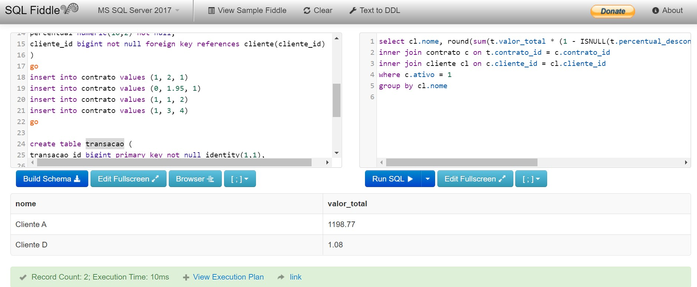
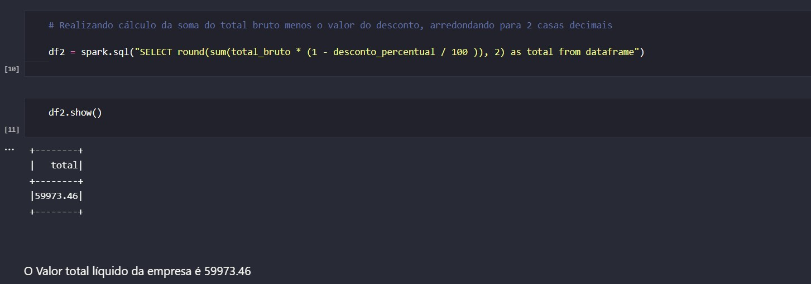
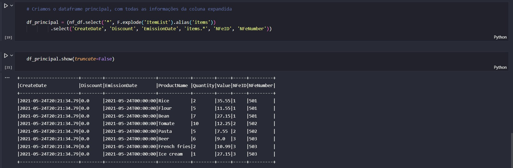
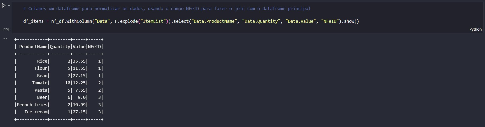
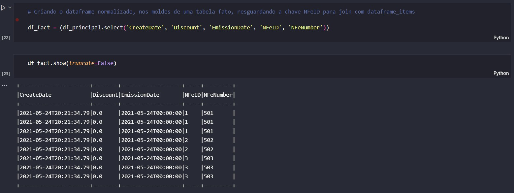
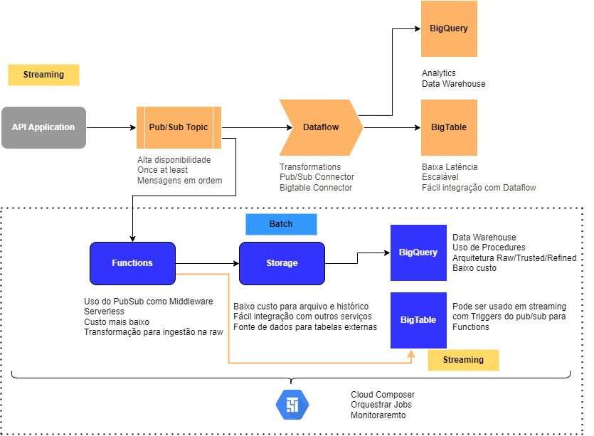

# Teste Data Engineer

1. Sua primeira tarefa consiste em escrever uma aplicação para calcular o ganho total da empresa, o qual é obtido a partir da taxa administrativa do serviço de cartão de crédito para seus clientes. Esse ganho é calculado sobre um percentual das transações de cartão de crédito realizadas por eles. O cálculo é baseado no conjunto de dados abaixo, transacao, contrato e cliente. O resultado esperado é uma consulta que retorne o ganho total da empresa por cliente que é 1.198,77 para o cliente A e 1,08 para o cliente D.

```sql
select 
    cl.nome, 
    round(sum(t.valor_total * (1 - ISNULL(t.percentual_desconto, 0 ) / 100) * (c.percentual / 100)) ,2) as valor_total 
from transacao t
inner join contrato c on t.contrato_id = c.contrato_id
inner join cliente cl on c.cliente_id = cl.cliente_id
where c.ativo = 1
group by cl.nome
```



2. A segunda tarefa consiste em calcular o total líquido da empresa. Esse total é calculado da seguinte forma total_liquido = soma(total_bruto – desconto_percentual). O resultado esperado é uma código com pyspark que retorne o total liquido da empresa que é 59973.46.

[Código em Pyspark com a resolução da segunda questão](desafio_data_engineer.ipynb)



3. O terceiro entregável consiste na transformação de dados disponíveis em arquivo Json para o formato de dataframe, algo comum no dia a dia da empresa. Após transformar esse Json em dataframe é possível perceber que a coluna "item_list" está como dicionário. Seu gestor pediu dois pontos de atenção nessa tarefa:

- Expandir a coluna num mesmo dataframe;
- Normalizar os itens dessa coluna de dicionário e dividí-los em dois dataframes separados, seguindo o modelo relacional.

#### Coluna expandida num mesmo dataframe:


#### Normalizando os dataframes, seguindo o modelo relacional:
- Dataframe Items:


- Dataframe Fato:


4. Imagine que o Json das notas fiscais é disponibilizado em uma API. Como você utilizaria as tecnologias da GCP para ingerir, transformar e, eventualmente, carregar esses dados em um BigTable? O quarto entregável consiste na construção de uma arquitetura de ingestão dos dados de nota fiscal do entregável anterior (como visto aqui), a qual deve atender aos seguintes pontos:

- Esquemas de fluxo de dados;
- Descrições de funcionamento (se necessário);
- Nomes de tecnologias em ecossistema GCP (serviços, conectores, bibliotecas e módulos).

